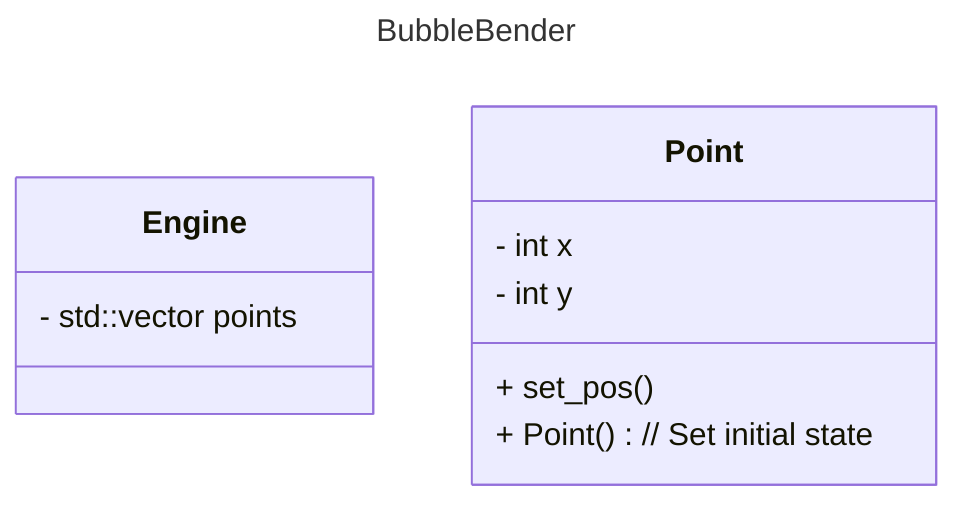

# Optical Flow Particle Field

## What is this?

BubbleBender takes in a video stream and allows the user to push bubbles floating around the frame. Bubble move in a pseudo-random Perlin Noise flow field. The push effect is achieved by translating the motion detected with Lucas-Kanade optical flow into acceleration of bubbles within the frame.

## Dependencies

- Docker installed
- A camera at `/dev/video0`

## Installation

Build Docker image:
```bash
project/tools/build_docker.sh
```

Enter Docker container:
```bash
project/tools/run_docker.sh
```

## Diagram
